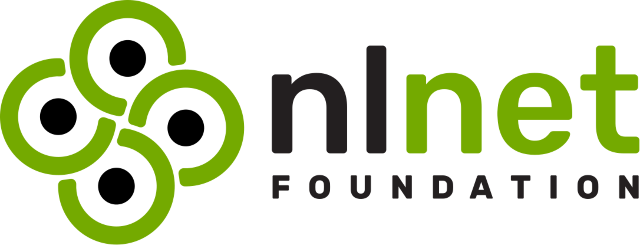
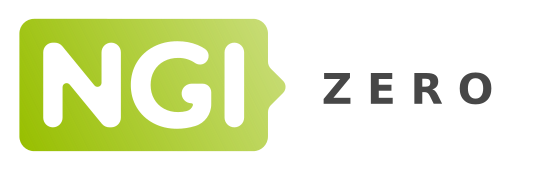

  
   
   
  
  

 

Stract is an open source web search engine hosted at [stract.com](https://stract.com/) targeted towards tinkerers and developers.

 

  

 
 

# 💡 Features

- Keyword search that respects your search query.
- Fully independent search index [with our own crawler](https://stract.com/webmasters).
- Advanced query syntax (`site:`, `intitle:` etc.).
- DDG-style [!bang syntax](https://duckduckgo.com/bang)
- Wikipedia and stackoverflow sidebar
- De-rank websites with third-party trackers
- Use [optics](https://github.com/StractOrg/sample-optics/blob/main/quickstart.optic) to almost endlessly customize your search results.
  - Limit your searches to blogs, indieweb, educational content etc.
  - Customize how signals are combined during search for the final search result
- Prioritize links (centrality) from the sites you trust.
- Explore the web and find sites similar to the ones you like.
- And much more!

# 👩‍💻 Setup

We recommend everyone to use the hosted version at [stract.com](https://stract.com/), but you can also follow the steps outlined in [CONTRIBUTING.md](CONTRIBUTING.md) to setup the engine locally.

# ‍💼 License

Stract is offered under the terms defined under the [LICENSE.md](LICENSE.md) file unless otherwise specified in the relevant subdirectory.

# 📬 Contact

You can contact us at [hello@stract.com](mailto:hello@stract.com) or open an [issue](https://github.com/StractOrg/stract/issues)/[discussion](https://github.com/StractOrg/stract/discussions) here on GitHub.

# 🏆 Thank you!

We truly stand on the shoulders of giants and this project would not have been even remotely feasible without them. An especially huge thank you to

- The authors and contributors of Tantivy for providing the inverted index library on which Stract is built.
- The commoncrawl organization for crawling the web and making the dataset readily available. Even though we have our own crawler now, commoncrawl has been a huge help in the early stages of development.

# 💰 Funding

This project is currently funded through [NGI0 Entrust](https://nlnet.nl/entrust), a fund established by [NLnet](https://nlnet.nl) with financial support from the European Commission's [Next Generation Internet](https://ngi.eu) program. Learn more at the [NLnet project page](https://nlnet.nl/project/Stract).

  
  &nbsp;
  &nbsp;
  

