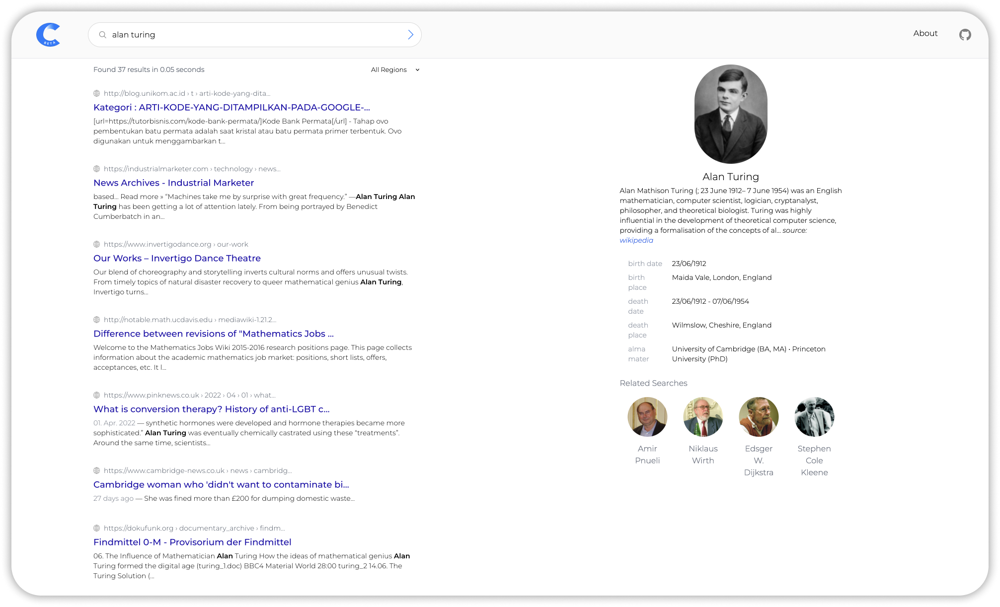

  
   
  
  

 

Stract is an open source web search engine hosted at [trystract.com](https://trystract.com/) targeted towards tinkerers and developers.

 

  

 
 

# 💡 Features
* Keyword search that respects your search query.
* Advanced query syntax (`site:`, `intitle:` etc.).
* DDG-style [!bang syntax](https://duckduckgo.com/bang)
* Wikipedia and stackoverflow sidebar
* De-rank websites with third-party trackers
* Use [optics](https://github.com/StractOrg/sample-optics/blob/main/quickstart.optic) to almost endlessly customize your search results.
  * Limit your searches to blogs, indieweb, educational content etc.
  * Customize how signals are combined during search for the final search result
* Prioritize links (centrality) from the sites you trust.
* Explore the web and find sites similar to the ones you like.
* Chat with an AI assistant that searches the web for you and cites its sources.
  * (This is currently not available on the hosted version due to resource limitations, but you can run it locally by following the steps outlined in [CONTRIBUTING.md](CONTRIBUTING.md))
* And much more!

# 👩‍💻 Setup
We recommend everyone to use the hosted version at [trystract.com](https://trystract.com/), but you can also follow the steps outlined in [CONTRIBUTING.md](CONTRIBUTING.md) to setup the engine locally.

# ‍💼 License
Stract is offered under the terms defined under the [LICENSE.md](LICENSE.md) file.

# 📬 Contact
You can contact us at [hello@trystract.com](mailto:hello@trystract.com) or in our [Discord server](https://discord.gg/BmzKHffWJM).

# 🏆 Thank you!
We truly stand on the shoulders of giants and this project would not have been even remotely feasible without them. An especially huge thank you to
* The authors and contributors of Tantivy for providing the inverted index library on which Stract is built.
* The commoncrawl organization for crawling the web and making the dataset readily available. Even though we have our own crawler now, commoncrawl has been a huge help in the early stages of development.