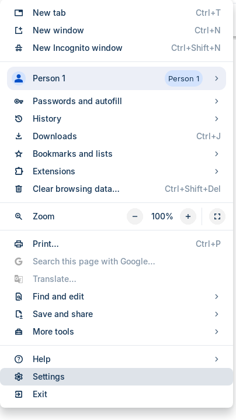
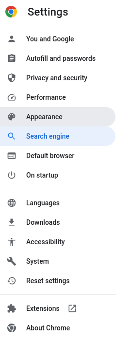
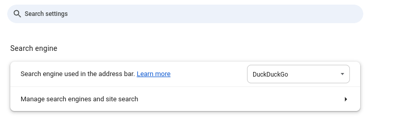
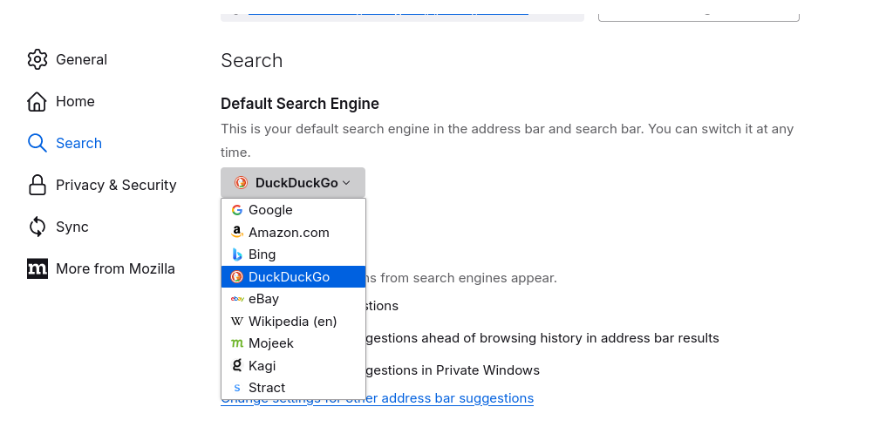
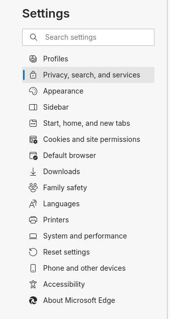
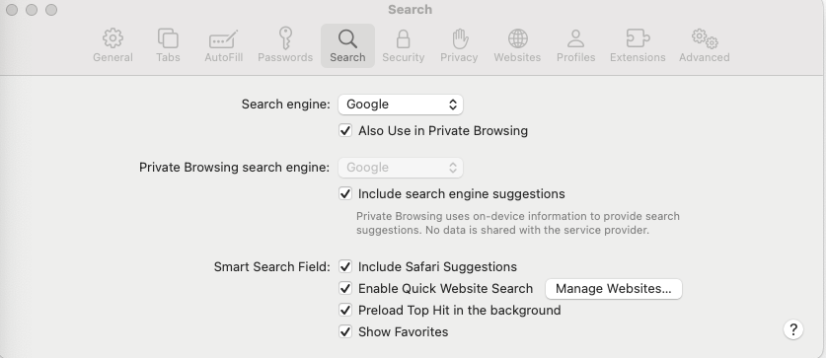
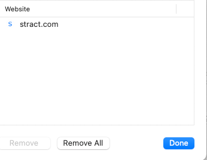

# Adding Stract to the Web Browser 

While it is not currently recommended to use Stract as your primary search option, you can add stract 
to your browser by following the instructions listed below for your respective browser. 

## Chrome

1. Navigate to [stract.com](https://stract.com)
2. Navigate to settings  

3. Select `Search engine`  

4. Click `Manage search engines and site search`  

5. Scroll down to `Inactive shortcuts`  

6. Select the peapod menu
7. Select `Make Default`  

## Firefox

1. Navigate to [stract.com](https://stract.com)
2. Right click the bar.
3. Select `Add "Stract Search"`  

4. Navigate to Settings
5. Select Search 
6. Use the `Default Search Engine` dropdown to select Stract

## Microsoft Edge
1. Navigate to [stract.com](https://stract.com)
2. Navigate to `Settings`  

3. Select `Privacy, search, and services`  

4. Scroll down to `Services`  

5. Select `Address Search Bar`  
6. Select `Manage search engines`  
7. Click the menu next to Stract and select `Make default`

## Safari 

Safari only allows a small fraction of available search engines as a default search engine; however, you can add Stract 
as a site search option. What follows describes that process. 

1. Navigate to [stract.com](https://stract.com)
2. Open Preferences 
3. Navigate to the `Search` panel  

4. Select `Manage Websites...`
5. Select stract.com from the options  

From here stract.com should appear in the search bar and you can arrow down to
it and begin typing.
