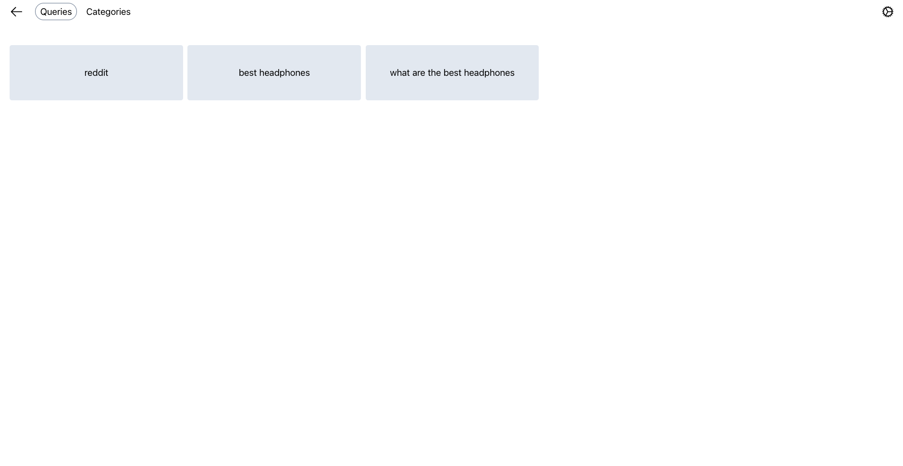
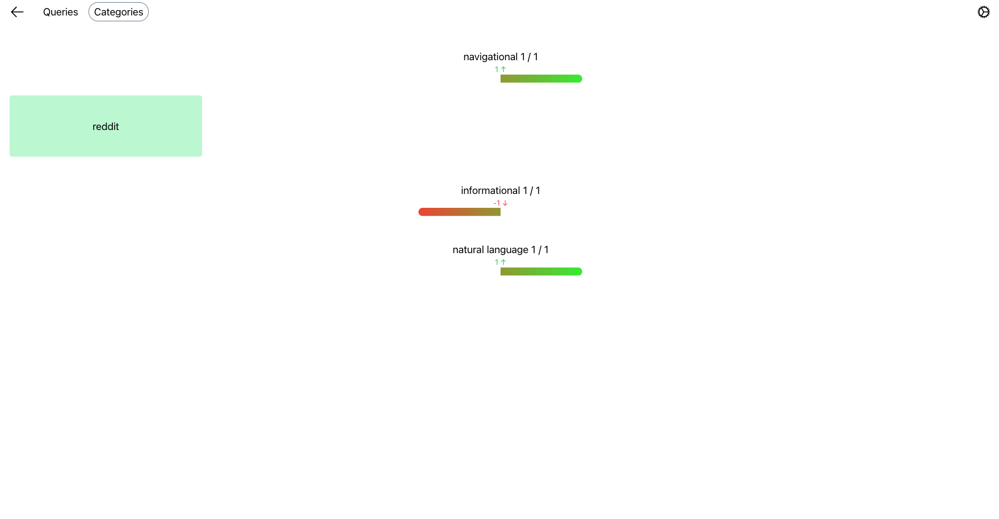

# Diff ranking algorithms
This is a tool used to visualise how changes to the ranking algorithm influences the results for different queries. It is used to try and determine if a change is beneficial or detrimental overall.

## Setup
* Install the dependencies using `npm install .`
* Start the server using `npm run dev -- --open`
* In a new terminal tab, start Stract by running `just dev` in the root of the stract folder

## Usage
You will first need to add some queries that can be used for the experiments, and optionally classify these queries into a chosen set of categories. After this is done, head over to the 'Experiments' tab and add a new experiment that will be used as a baseline.

After the experiment is finished, make some changes to the ranking algorithm and perform a new experiment after the changes are done. The two experiments can now be selected and compared.

This should show the following page containing the common queries between the two experiments

  

Select one of the queries which will show a side-by-side view of the results from both experiments. It is random whether the baseline or the experiment is shown on the left or right side. This can be toggled under settings. You can use the `a` and `b` keyboard shortcuts to quickly annotate the results and move to the next/previous query using the arrow keys.

After some queries have been annotated, the query overview should now color improved queries green and deteriorated queries red. The category overview shows an aggregate of how the ranking change has impacted queries in the chosen categories. Clicking a category shows the queries under the particular category.

  

